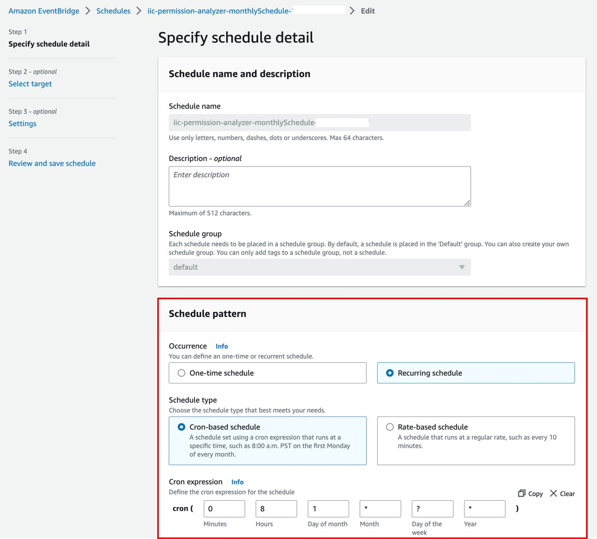
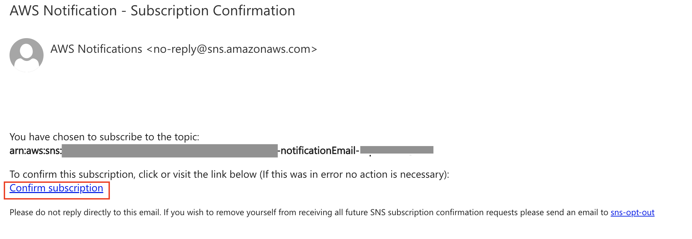
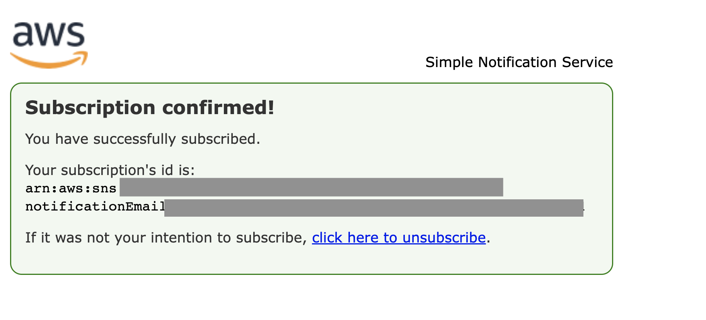
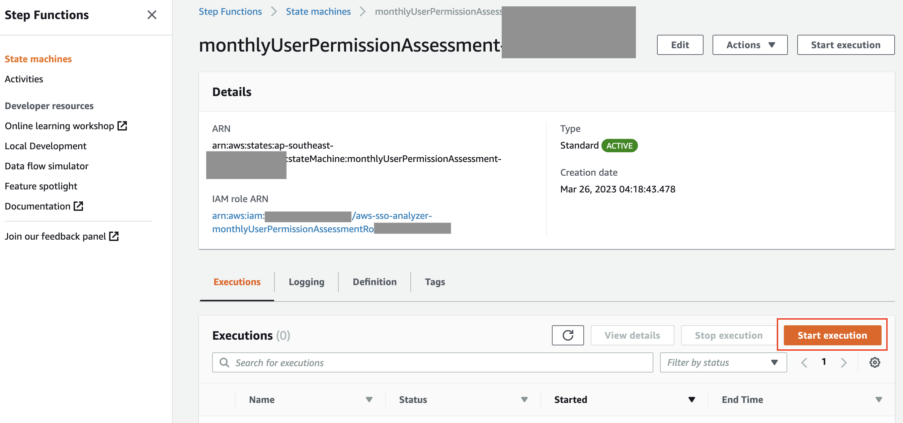
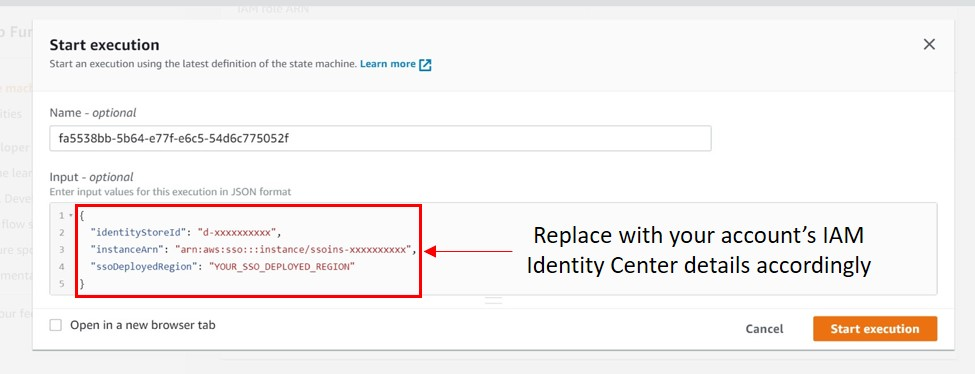
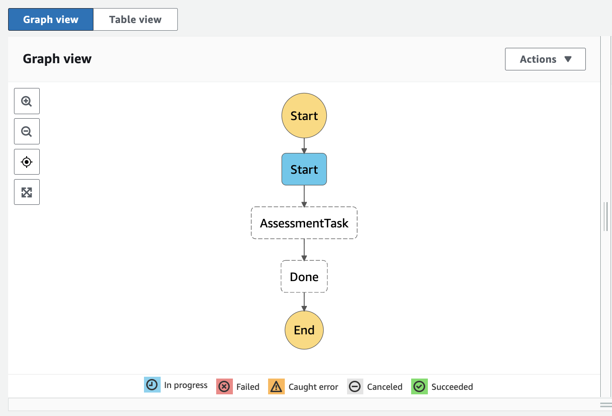
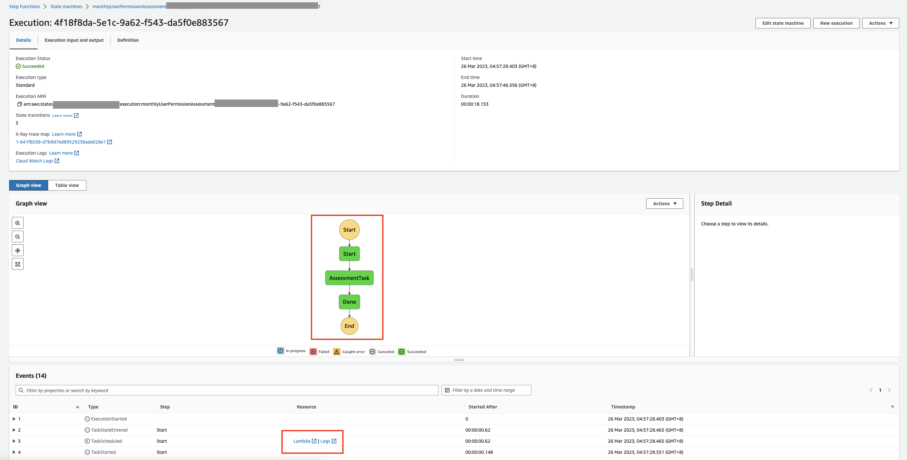
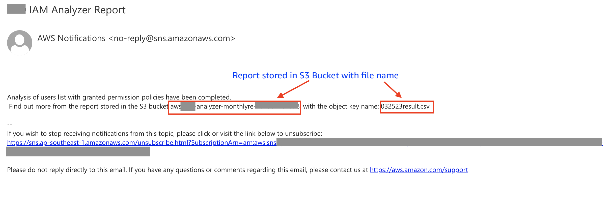
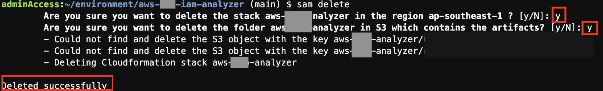

# AWS IAM Identity Center Permission Policies Analyzer

This solution uses AWS SDKs to automate the analysis of all users in AWS Identity Center (previously AWS SSO) and retrieve the attached permission policies (Inline, AWS Managed, Customer Managed) based on the assigned SSO group.

AWS Services used
- Application Composer - to generate baseline template and resources
- Amazon EventBridge
- AWS Step Functions
- AWS Lambda
- Amazon DynamoDB
- Amazon S3

Solution Architecture


## Prerequisites
In your own AWS environment, make sure that you have the following set up:

* An AWS IAM Identity Center instance set up in the account
* [AWS IAM Identity Center instance metadata](https://docs.aws.amazon.com/singlesignon/latest/APIReference/API_InstanceMetadata.html) that you would like to perform the analysis on:
    * The AWS IAM Identity Center instance identityStoreId - example: d-xxxxxxxxxx
    * The AWS IAM Identity Center instance instanceArn -  example: arn:aws:sso:::instance/ssoins-xxxxxxxxxx
* Access and permission to deploy the related AWS services in CloudFormation shown below.

**_NOTE:_** This solution is expected to deploy in the account in which your AWS Identity Center instance is being setup. If you wish to deploy in other accounts, you need to establish cross-account access for the IAM roles of the relevant services’ shown in the solution architecture.

* [AWS SAM CLI installed](https://docs.aws.amazon.com/serverless-application-model/latest/developerguide/install-sam-cli.html). We will deploy the solution using AWS SAM. If you would like to understand more about how AWS SAM works and its specification, you can refer to this [documentation](https://docs.aws.amazon.com/serverless-application-model/latest/developerguide/sam-specification.html) that explains more in detail.

## Deployment steps
### Deploying with AWS SAM CLI
1. Make sure that you have AWS SAM CLI installed. Otherwise, please [follow the steps here to install](https://docs.aws.amazon.com/serverless-application-model/latest/developerguide/install-sam-cli.html) the AWS SAM CLI.
2. Clone a copy of this repo. You can either deploy this by using CloudFormation or AWS SAM. The two Lambda Function source codes are in the `src` folder.
3. `cd aws-iam-identity-center-permission-policies-analyzer`
4. `sam deploy --guided` and follow the step-by-step instructions to indicate the deployment details such as desired CloudFormation stack name, regions and other details. For example:


**_NOTE:_** "Stack Name" has a max of 34 characters and can contain only lower-case characters, numbers, periods, and dashes. 

### (Optional) Update your preferred schedule preference
The default specification for the Amazon EventBridge Schedule is configured with cron schedule: 1st day of each month 0800 UTC +8. Update your preferred schedule and timezone accordingly. To update:
- Go to [EventBridge](https://console.aws.amazon.com/events/home) console, click `Schedules` under the section `Scheduler` on the left hand panel. Check the box of `{StackName}-monthlySchedule-{randomID}` and click “Edit”.


- Under the “Schedule pattern” segment, update your preferred scheduling. For more information about the different types of EventBridge scheduling, please refer to this [documentation](https://docs.aws.amazon.com/scheduler/latest/UserGuide/schedule-types.html). For this example, we are using a recurring type [schedule using cron](https://docs.aws.amazon.com/scheduler/latest/UserGuide/schedule-types.html#cron-based). The CloudFormation specifies the cron schedule on the 1st day of each month 0800 UTC +8 by default. Update your preferred schedule and timezone accordingly and click “Next”:




### Confirm SNS topic subscription for email notifications
Check the email address you entered during the deployment stage of this solution for an email sent by no-reply@sns.amazonaws.com. Follow the steps in the email to confirm the Amazon SNS topic subscription. 




### (Optional) Manually triggering the review for the first time or on as-needed basis
After you have updated the schedule above, the review process will run on the specified timing and frequency. You might want to trigger for the first time after you have deployed the solution, or anytime on as-needed basis outside of the scheduled window. 

To do so, head to [Step Functions console](https://console.aws.amazon.com/states/home?#/statemachines), select the State machine `monthlyUserPermissionAssessment-{randomID}` and click the “Start Execution” button. Input the following event pattern and click “Start Execution".

```
{
  "identityStoreId": "d-xxxxxxxxxx",
  "instanceArn": "arn:aws:sso:::instance/ssoins-xxxxxxxxxx",
  "ssoDeployedRegion": "YOUR_SSO_DEPLOYED_REGION" (example: us-east-1)
}
```
**_NOTE:_** The format and keyword format is important to execute the Lambda function successfully: 




Once the execution starts, you will arrive at the execution page and able to check on the execution details. The flow will turn green if the step has been executed successfully. You can also refer to the segment under ‘Events’ and check the Lambda function or logs if you need to troubleshoot or refer to the details.





### Notification from each successful review
After each successful execution, you should receive an email notification. You can then retrieve the report from the S3 bucket according to the object key name specified in the email. An example of the email notification is as below:




csv report details:
| User | PrincipalId | PrincipalType | GroupName | AccountIdAssignment | PermissionSetARN | PermissionSetName | Inline Policy | Customer Managed Policy | AWS Managed Policy | Permission Boundary |
| ----------- | ----------- | ----------- | ----------- | ----------- | ----------- | ----------- | ----------- | ----------- | ----------- | ----------- |
| username      | An identifier for an object in IAM Identity Center, such as a user or group.       | USER or GROUP       | Group’s display name value (if PrincipalType is GROUP) | Identifier of the AWS account assigned with the specified permission set      | ARN of the permission set       | Name of the permission set        | Inline policy that is attached to the permission set        | Specifies the names and paths of the customer managed policies that you have attached to your permission set    | Details of the AWS managed policy       | Permission boundary details (Customer Managed Policy Reference and/or AWS managed policy ARN)     |

### (Optional) Customizing your user notification email
If you wish to customize your email notification subject and email content, you can do so at the Lambda Function `{StackName}-dataTransformLoadFunction-{RandomID}`. Scroll down to the bottom of the source code and edit the following part accordingly:


## Clean up the resources
To clean up the resources that you created for this example, follow the steps below:

1. Empty your S3 bucket (Go to S3 > search for your bucket name > click “Empty" and follow the instruction on screen to empty it)
2. Either (1) go to the CloudFormation console and delete the stack, or (2) run the following in your terminal to delete with AWS SAM CLI:
`sam delete`

3. Follow through the instruction on your terminal and select `y` when prompted for the decision to delete the stack.
